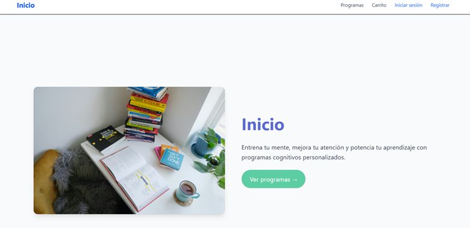
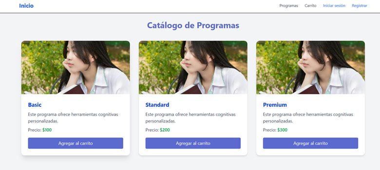
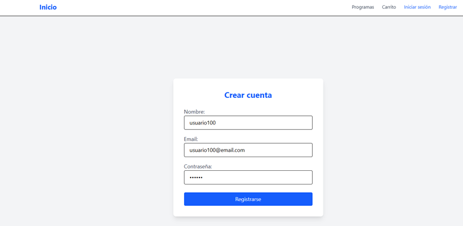
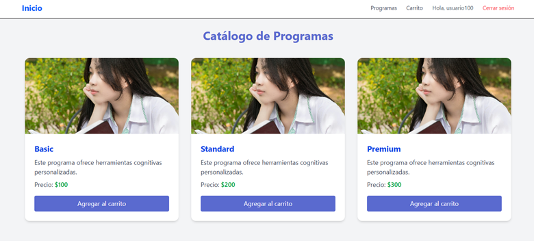
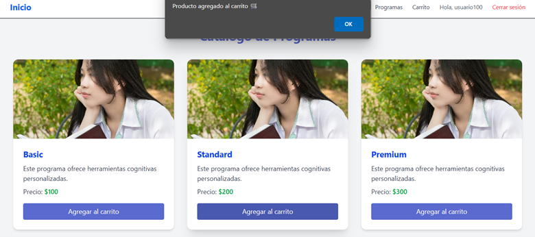
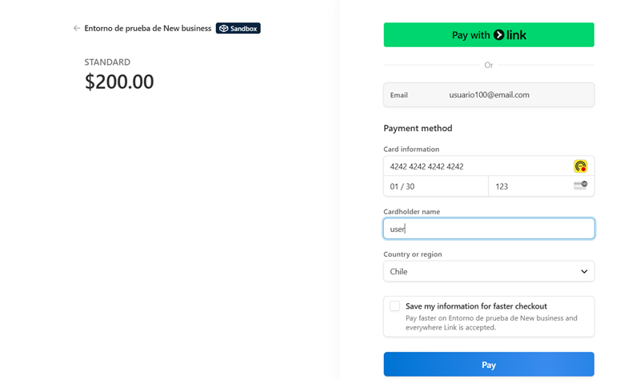
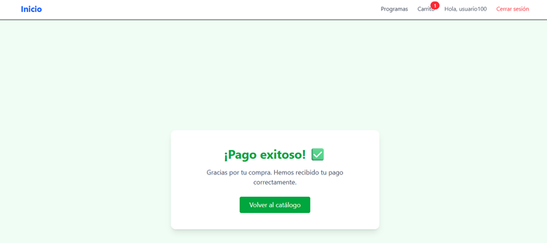

# 🧠 Proyecto1M7 - E-Commerce de Juegos Cognitivos

Este proyecto corresponde al Módulo 7 del bootcamp e incluye un sistema completo de e-commerce con frontend en React y backend en Node.js. Los usuarios pueden registrarse, explorar programas, agregarlos al carrito y realizar pagos a través de Stripe.

---

## 🧩 Funcionalidades

### ✅ Frontend (React + Vite)
- Registro e inicio de sesión de usuario.
- Visualización de programas disponibles.
- Agregar al carrito.
- Visualización y modificación del carrito.
- Proceso de pago simulado con Stripe.
- Pantalla de confirmación de compra exitosa.

### ✅ Backend (Node.js + Express + MongoDB)
- API RESTful con rutas protegidas mediante JWT.
- Modelos de usuario, producto y carrito.
- Integración con Stripe para crear sesiones de pago.
- Swagger para documentación de la API.

---

## 🌐 Despliegue

### 🔗 Frontend en Netlify:
https://proyecto1m7.netlify.app/

### 🔗 Backend en Render:
https://proyecto1m7-api.onrender.com

📘 Swagger disponible en:
https://proyecto1m7-api.onrender.com/api-docs

---

## 🧪 Flujo de usuario (con capturas)

### 1. Página principal



---

### 2. Ver programas

Al hacer clic en “Ver programas” se despliega el catálogo de programas y precios:



---

### 3. Registro de usuario

Formulario para crear una nueva cuenta:



---

### 4. Perfil activo y programas disponibles

Después de registrarse, el usuario es identificado por su nombre y puede agregar programas al carrito:



---

### 5. Agregar al carrito

Se muestra un mensaje confirmando la acción:



---

### 6. Carrito

Aquí se pueden ver los productos agregados, eliminar alguno o vaciar todo:


---

### 7. Pago con Stripe

Se abre la interfaz de Stripe para ingresar los datos de prueba:



---

### 8. Éxito en el pago

Se muestra una pantalla de confirmación:



---

## ⚙️ Tecnologías

- **Frontend**: React, Vite, TailwindCSS
- **Backend**: Express.js, MongoDB Atlas, Mongoose
- **Autenticación**: JWT
- **Pago**: Stripe
- **Documentación**: Swagger + YAML

---

## 🚀 Cómo ejecutar en local

### Backend
```bash
cd Proyecto-backend
npm install
npm run dev
